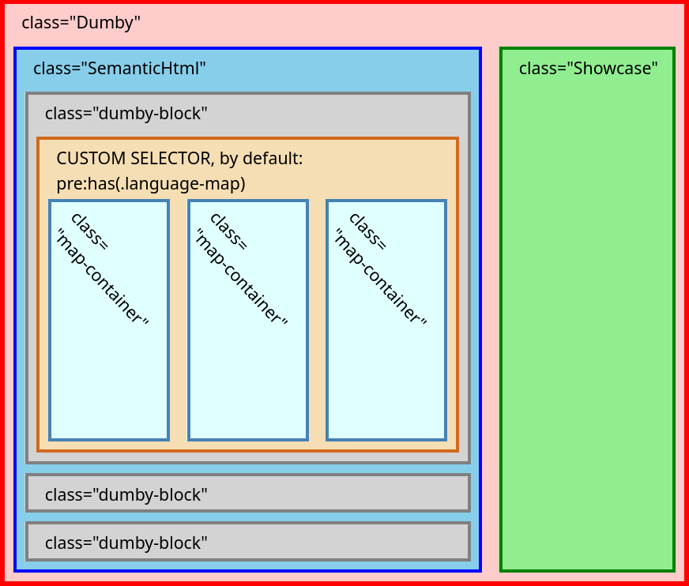

# Dumbymap

This library generate web maps from Semantic HTML, play around with [demo page](https://outdoorsafetylab.github.io/dumbymap/)

## Getting Started

Node.js:

```bash
npm install dumbymap
```
```js
import { markdown2HTML, generateMaps } from 'dumbymap'

// Create container element
const container = document.createElement('div')
document.body.append(container)

// Convert markdown text into Semantic HTML
markdown2HTML(container, '# Heading\n\n```map\nid: foo\nuse: Maplibre\n```\n')

// Gernerate maps from code block
const dumbymap = generateMaps(container)
```

Browser (CDN):
- unpkg: https://unpkg.com/dumbymap@latest/dist/dumbymap.mjs

## Semantic HTML

Dumbymap adds several features by Semantic HTML:

### Code Block for map

Generated from Element fits CSS Selector `:has(.language-map)`

It generates maps by `textContent` in YAML format, done by [`mapclay`](/outdoorsafetylab/mapclay).

For example:
~~~markdown
<!-- Markdown Text -->
```map
use: Maplibre
width: 200px
```

<!-- HTML -->
<pre><code class="language-map">use: Maplibre
width: 200px</code></pre>
~~~

### DocLink

Generated from anchor element which:
1. With has link for [document fragment](https://developer.mozilla.org/en-US/docs/Web/HTML/Element/a#linking_to_an_element_on_the_same_page).
2. With title starts from `=>`
3. The following text in title would be treated as CSS selector of target element

It shows leader-line to target element on hover, for example:

```markdown
<!-- Markdown Text -->
[link](#TEXT "=>.random-class")

<!-- Anchor Element -->
<a href="#TEXT" title="=>.random-class">link</a>
```

Generated from anchor element which:
1. With has link for [document fragment](https://developer.mozilla.org/en-US/docs/Web/HTML/Element/a#linking_to_an_element_on_the_same_page). 
2. With title starts from `=>`
3. The following text of title would be treated as CSS selector of target element

Class name `with-leader-line` and `doclink` would be added to element.

It shows leader-line to target element on hover, for example:

```markdown
<!-- Markdown Text -->
[link](#TEXT "=>.random-class")

<!-- Anchor Element -->
<a href="#TEXT" title="=>.random-class">link</a>


<!-- Links above is transfered to this -->
<a class="with-leader-line doclink" href="#TEXT" title="=>.random-class">link</a>
```

### GeoLink

Generated from anchor element with [geo URI scheme](https://en.wikipedia.org/wiki/Geo_URI_scheme).
Class name `with-leader-line` and `geolink` would be added to element.

It show leader-line to coordinates in target map elements, for example:

```markdown
<!-- markdown text -->
[Taiwan](geo:24,121)

<!-- anchor element -->
<a href="geo:24,121" title="Here it is!">Taiwan</a>


<!-- Links above is transfered to this -->
<a class="with-leader-line geolink" href="geo:24,121" title="Here it is!">Taiwan</a>
```

It changes behaviors by query parameters in link:
1. If `xy` is specified, GeoLink would use its value instead of value in geo URI scheme
2. If `id` is specified, GeoLink would only points to map with its value. Can use comma to add multiple id

For example:
```html
<!-- The following link points to coordinates [274527,2665529] in map element "map1" and "map2"
<a href="geo:24,121?xy=274527,2665529&id=map1,map2" title="Here it is!">Taiwan</a>
```

## Structure

After `generateMaps()`, the container has the following structure:



## Layouts

Dumbymap switch layouts by attribute `data-layout` of container. Most of the features are done by pure CSS.

You can add custom layout by options `layouts`. For example, the following code add a new layout `sticky` to stick `Showcase` at bottom right corner:

```css
.Dumby[data-layout='sticky'] {
  .Showcase {
    display: block;
    width: 20vw;
    height: 40vh;
    position: absolute;
    right: 0;
    bottom: 0;
    background: red;
  }
}
```

```js
generateMaps(container, { layouts: "sticky" })
```


## Dependencies

- [leader-line](https://anseki.github.io/leader-line/)
- [plain-draggable](https://anseki.github.io/plain-draggable/)
- [markdown-it](https://github.com/markdown-it/markdown-it/)
- [mapclay](https://github.com/outdoorsafetylab/mapclay)
- [EasyMDE](https://github.com/Ionaru/easy-markdown-editor)


## Motivation

* Respect Semantic HTML
* User Friendly: The target audience includes Hikers, Outdoor Workers
* Easy to Extend: Can co-work with various of Modern Map Libraries, no one dominates
* [Designed to Last](https://jeffhuang.com/designed_to_last/)

## See Also

* [obsidian-map-view](https://github.com/esm7/obsidian-map-view)
* [odyssey.js](http://cartodb.github.io/odyssey.js/)
* [StoryMapJS](https://storymap.knightlab.com/)
