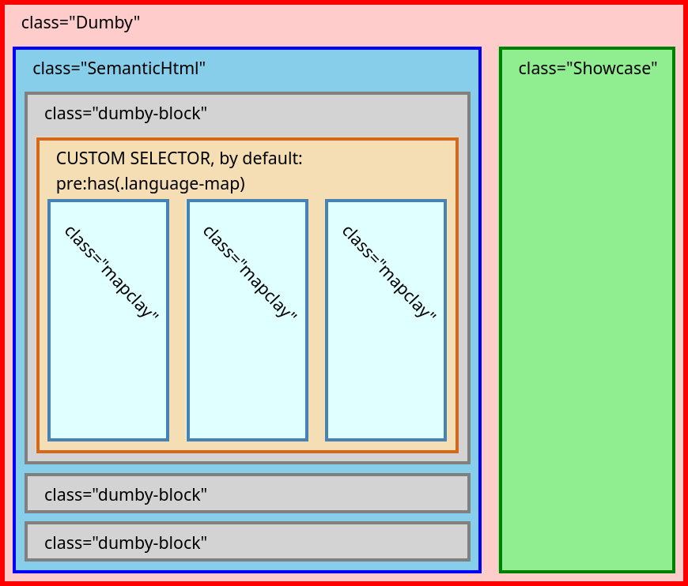

# Dumbymap

This library generate web maps from [Semantic HTML], just play around with [demo page](https://outdoorsafetylab.github.io/dumbymap/)

> [!CAUTION]
> DumbyMap is not in production stage. API is not stable now, use it carefully

## Getting Started

Browser (CDN):
- unpkg: https://unpkg.com/dumbymap@latest/dist/dumbymap.mjs

Node.js:

```bash
npm install dumbymap
```
```js
import { markdown2HTML, generateMaps } from 'dumbymap'

// Create container element
const container = document.createElement('div')
document.body.append(container)

// Convert markdown text into Semantic HTML
markdown2HTML(container, '# Heading\n\n```map\nid: foo\nuse: Maplibre\n```\n')

// Gernerate maps from code block
const dumbymap = generateMaps(container, options ?? {})
```

For more information, please visie [docs page](https://outdoorsafetylab.github.io/dumbymap/docs/global.html#generateMaps)


## Semantic HTML

Dumbymap adds several features from contents of Semantic HTML:

### Code Block for map

Generated from Element fits CSS Selector `:has(.language-map)` (by default)

It generates maps by `textContent` in YAML format, done by [mapclay]

For example:
~~~markdown
<!-- Markdown Text -->
```map
use: Maplibre
width: 200px
```

<!-- HTML -->
<pre><code class="language-map">use: Maplibre
width: 200px</code></pre>
~~~

### DocLink

Generated from anchor element which:
1. With has link for [document fragment](https://developer.mozilla.org/en-US/docs/Web/HTML/Element/a#linking_to_an_element_on_the_same_page).
2. With title starts from `=>`
3. The following text in title would be treated as CSS selector of target element

It shows leader-line to target element on hover, for example:

```markdown
<!-- Markdown Text -->
[link](#TEXT "=>.random-class")

<!-- Anchor Element -->
<a href="#TEXT" title="=>.random-class">link</a>
```

Generated from anchor element which:
1. With has link for [document fragment](https://developer.mozilla.org/en-US/docs/Web/HTML/Element/a#linking_to_an_element_on_the_same_page). 
2. With title starts from `=>`
3. The following text of title would be treated as CSS selector of target element

Class name `with-leader-line` and `doclink` would be added to element.

It shows leader-line to target element on hover, for example:

```markdown
<!-- Markdown Text -->
[link](#TEXT "=>.random-class")

<!-- Anchor Element -->
<a href="#TEXT" title="=>.random-class">link</a>


<!-- Links above is transfered to this -->
<a class="with-leader-line doclink" href="#TEXT" title="=>.random-class">link</a>
```

### GeoLink

Generated from anchor element with [geo URI scheme](https://en.wikipedia.org/wiki/Geo_URI_scheme).
Class name `with-leader-line` and `geolink` would be added to element.

It show leader-line to coordinates in target map elements, for example:

```markdown
<!-- markdown text -->
[Taiwan](geo:24,121)

<!-- anchor element -->
<a href="geo:24,121">Taiwan</a>


<!-- Links above is transfered to this -->
<a class="with-leader-line geolink" href="geo:24,121">Taiwan</a>
```

It changes behaviors by query parameters in link:
1. If `xy` is specified, GeoLink would use its value instead of value in geo URI scheme
1. If `id` is specified, GeoLink would only points to map with its value. Can use comma to add multiple id
1. If `type` is specified, anchor on map changes appearance (now only support `type=circle`)

For example:
```html
<!-- The following link points to coordinates [274527,2665529] in map element "map1" and "map2"
<a href="geo:24,121?xy=274527,2665529&id=map1,map2">Taiwan</a>
```

If `title` of element is specified, leader-line use it as label, for example:
```markdown
<!-- markdown text -->
[Taiwan](geo:24,121 "Here it is!")

<!-- anchor element -->
<a href="geo:24,121" title="Here it is!">Taiwan</a>
```

## Structure

After `generateMaps()`, the container has the following structure:



For each element:
* `class="Dumby"`: Container of DumbyMap Contents. It uses attribute `data-layout` to switch layout
* `class="SemanticHtml"`: Container of Semantic HTML
* `class="Showcase"`: Container of map with `class="focus"`. Some layouts use it to display focused map
* `class="dumby-block"`: Block contains part of contents of Semantic HTML.
* `class="mapclay"`: Map generated by [mapclay]

## Layouts

Dumbymap switch layouts by attribute `data-layout` of container. Most of the features are done by pure CSS.

You can add custom layout by options `layouts`. For example, the following code add a new layout `sticky` to stick `Showcase` at bottom right corner:

```css
.Dumby[data-layout='sticky'] {
  max-width: 80em;

  .Showcase {
    display: block;
    width: 20vw;
    height: 40vh;
    position: absolute;
    right: 20px;
    bottom: 20px;
    background: red;
  }
}
```

```js
generateMaps(container, { layouts: "sticky" })
```

<details><summary>Result:</summary>


</details>


## Dependencies

- [leader-line](https://anseki.github.io/leader-line/)
- [plain-draggable](https://anseki.github.io/plain-draggable/)
- [markdown-it](https://github.com/markdown-it/markdown-it/)
- [mapclay]
- [EasyMDE](https://github.com/Ionaru/easy-markdown-editor)


## Motivation

* Respect Semantic HTML
* User Friendly: The target audience includes Hikers, Outdoor Workers
* Easy to Extend: Can co-work with various of Modern Map Libraries, no one dominates
* [Designed to Last](https://jeffhuang.com/designed_to_last/)

## See Also

* [obsidian-map-view](https://github.com/esm7/obsidian-map-view)
* [odyssey.js](http://cartodb.github.io/odyssey.js/)
* [StoryMapJS](https://storymap.knightlab.com/)

[mapclay]: https://github.com/outdoorsafetylab/mapclay
[Semantic HTML]: https://developer.mozilla.org/en-US/docs/Glossary/Semantics#semantics_in_html
